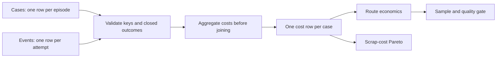

# Repair unit economics

**Should a cheaper repair process be scaled when fewer devices become sellable?**

A Python/Pandas toolkit for comparing repair routes, retaining the cost of failed
repairs and rework, and identifying which failure families consume scrap cost.
Built for operations analysts and business operations teams evaluating a pilot.

> Independent portfolio demonstration. Every row, price and threshold is invented.
> This is not production software deployed at an employer. [Data provenance](DATA_PROVENANCE.md).

## What the demo shows

The seeded cohort contains 1,200 repair cases. The pilot reduces spend per started
case, but loses most of that advantage when measured against sellable output.

| Synthetic route | Cases | Yield | Cost / started case | Cost / sellable unit | Decision |
|---|---:|---:|---:|---:|---|
| Pilot | 589 | 85.40% | €24.17 | €28.30 | No-go: quality |
| Standard | 611 | 94.60% | €27.11 | €28.66 | Eligible for controlled pilot |

The quality gate uses an illustrative 90% minimum yield and 50-case minimum.
Passing means eligible for further testing, not authorization to scale.
See the [actual output](examples/summary.json) and [failure Pareto](examples/failure_pareto.csv).

## Run in two minutes

Requires Python 3.11+. From this repository directory:

```bash
python3 -m venv .venv
source .venv/bin/activate
python -m pip install -e '.[dev]'
python -m repair_economics --output outputs
python -m pytest -q
```

Windows activation: `.venv\Scripts\activate`.
The demo needs no accounts, keys, downloads of datasets, or sibling repositories.
Change cohort size with `--cases 10000` and generator seed with `--seed 42`.

## Metric contract

```text
Cost per sellable unit = all repair costs in a closed cohort / sellable cases
Yield                 = sellable cases / all started cases in that cohort
Repeat repair rate    = cases with >1 repair attempt / all cases
Scrapped cost         = all repair spend on cases whose final outcome is scrap
```

Money enters as nonnegative integer euro cents. Costs include parts, labor and
logistics across every repair attempt. A case represents one repair episode, not
an entire device lifetime. A device returning in a later episode needs a new case ID.
Each case has one route assignment, one primary failure family, and one terminal
outcome. One event is one repair attempt, not a part invoice line.

If both routes work on an episode, assign the episode to its initial policy arm
before calling this API; the metric is then policy-arm economics, not vendor cost
attribution. The demo has no mixed-route cases.

Zero sellable units produce an undefined cost (`null` in JSON), never zero. Open
cases are rejected because unfinished outcomes would distort yield. Each case
must have at least one cost event, including an explicit zero-cost event if valid.
The failure Pareto describes association with scrap spend; it does not establish
physical root cause. Costs are assigned once to the primary family, avoiding
multi-code double counting.

## Design



- [Calculation and validation](src/repair_economics/core.py)
- [Synthetic generator](src/repair_economics/demo.py)
- [Regression tests](tests/test_economics.py): hand-calculated €35 example, duplicate
  keys, orphan events, missing costs, negative/fractional money, zero denominator,
  input-order invariance and total-cost reconciliation.
- [Decision walkthrough](docs/DECISION_MEMO.md)

Use with dataframes:

```python
from repair_economics.core import analyze
from repair_economics.demo import generate

cases, events = generate()
result = analyze(cases, events)
print(result.summary)
```

## Practical limits

This measures repair spend, not full COGS or profit. Acquisition cost, overhead,
resale grade, revenue, warranty, capacity and inventory holding costs are excluded.
Production adoption would require validated source mappings, cohort maturity rules,
confidence intervals, model/failure-mix adjustment and a controlled experiment.
It operates in memory; the demo is not a claim of warehouse-scale benchmarking.

Business framing and implementation are separated from the employer's data and systems. MIT licensed.
